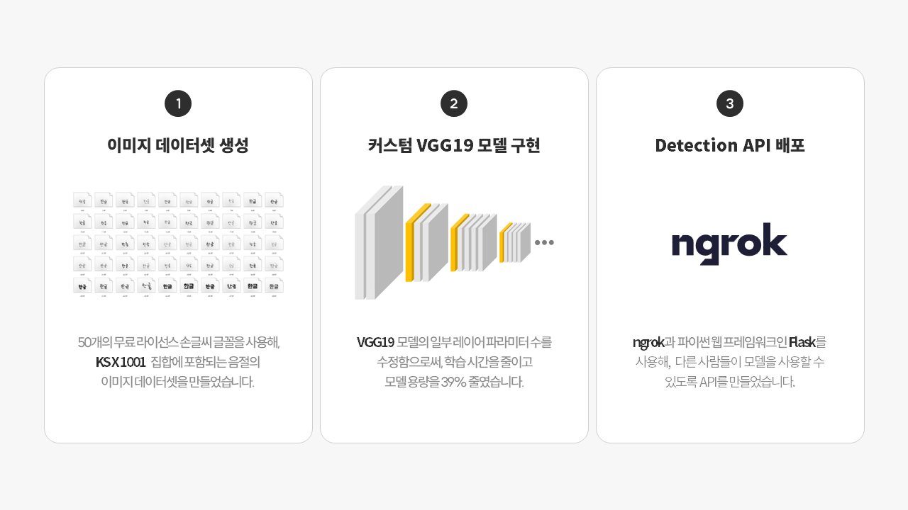
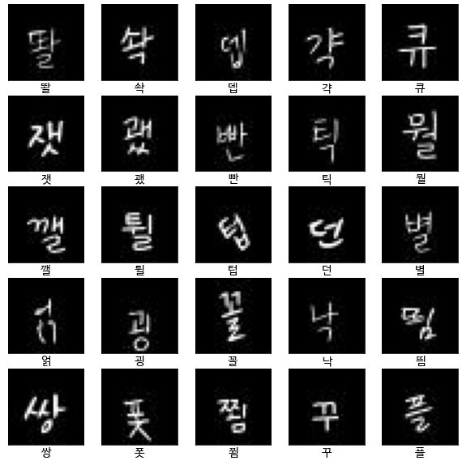
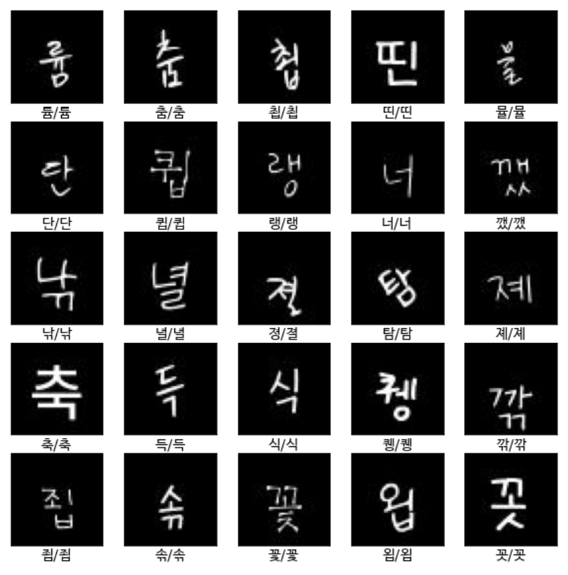
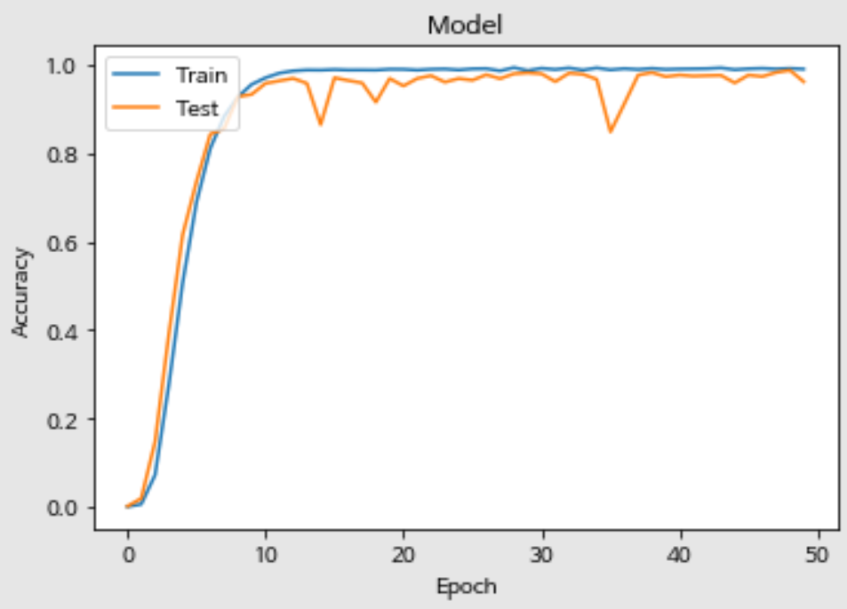
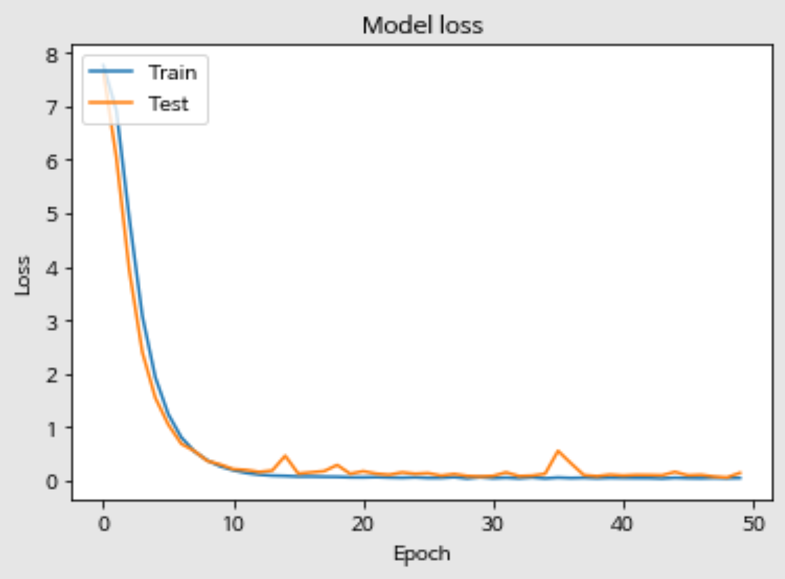

# 커스텀 VGG19 모델로 만든 한글 음절 인식기

- Author :  **Song Kitae**  (Department of AI Software, Dankook Software High School)
- Use Module :  **`Tensorflow 2`**,  **`Keras`**....
- Key Word : 딥러닝, VGG19, 한글 OCR

# 요약



1. 50개의 무료 라이선스 손글씨 글꼴을 이용해 117,500장의 이미지 데이터셋을 직접 만들었다. (48 x 48 x 1)
2. VGG19 모델의 일부 레이어 파라미터 수를 수정함으로써, 학습 시간을 줄이고 모델 용량을 39% 줄였다.
3. ngrok과 파이썬 웹 프레임워크인 Flask를 사용해, 다른 사람들이 모델을 사용할 수 있도록 API를 만들었다.
4. 약 99%의 정확도를 얻어낼 수 있었고, Minimum Loss는 0.05를 달성했다.

# 시작하며...

여러가지의 CNN 모델에 대해 공부하던 도중, 우연히 [@junstar92](https://github.com/junstar92)님의 깃헙에서 [한글 음절 인식기](https://github.com/junstar92/hangul-syllable-recognition)을 보게되었고, 토이 프로젝트로 한글 음절 OCR을 구현했으며, [ngrok](https://ngrok.com/)과 [Flask](https://flask.palletsprojects.com/)를 사용해 API를 배포해보았습니다.

전체 소스코드는 [여기](./hangul_recognition.ipynb)를 누르시면 확인할 수 있습니다.

# 데이터셋

총 50개의 무료 라이선스 손글씨 폰트를 사용했으며, [KS X 1001](https://en.wikipedia.org/wiki/KS_X_1001) 집합에 포함되는 음절의 이미지 데이터셋을 직접 만들었습니다.

이미지를 생성하는 코드가 궁금하시다면 [여기](./hangul_img_generator.py)를 눌러주세요. [PIL 모듈](https://pillow.readthedocs.io/en/stable/)을 사용해서 만들었습니다. 또, 이미지 데이터셋을 만들 때 사용한 글꼴 목록이 궁금하시다면 [여기](./font/README.md)를 눌러주세요.

## 생성된 이미지 데이터셋 결과

<center>



</center>

`./data/dataset.zip` 파일에 117,500장의 이미지 데이터(48*48)가 압축되어 들어있으며, 직접 [다운로드](https://raw.githubusercontent.com/kitae0522/hangul-recognition/main/data/dataset.zip)하실 수 있고, wget를 이용해서 다운로드 하실 수 있습니다.

```shell
$ wget -O dataset.zip https://raw.githubusercontent.com/kitae0522/hangul-recognition/main/data/dataset.zip
```

# 학습 결과

`train` 데이터셋에서 약 99%의 accuracy를, 0.05의 loas, `valid` 데이터셋에서 약 98%의 accuracy를, 0.06의 loss를 가지며 학습을 완료했습니다.

<center>



</center>

> 왼쪽이 모델이 예측한 결과, 오른쪽이 진짜 정답입니다.

|  | 
| - | - | 
| Model accuracy | Model 

# Give me feedback!
- Tel : 010-7447-1509
- E-Mail : kitae040522@gmail.com

컴퓨터 비전을 공부하고 있는 고등학생입니다. 피드백을 남겨주시면 감사하겠습니다.