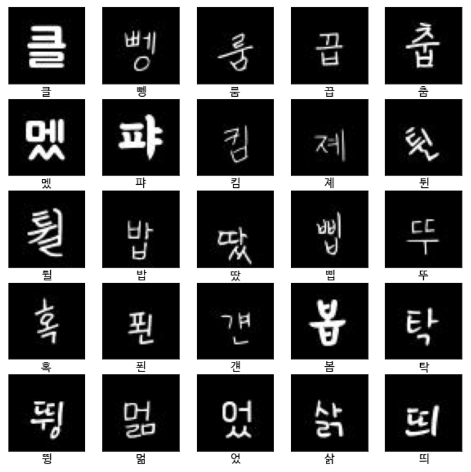

# hangul-recognition
한글 인식기

## TODO
- [x] 손글씨 폰트로 117,500개의 글자 이미지 제작
- [x] 모델 제작
- [ ] 모델 API 배포
- [ ] 테스트

## 사용된 손글씨 폰트 목록

총 50개의 손글씨 폰트를 사용했으며, 사용한 폰트는 아래와 같습니다.

| # | 폰트명 | 경로 |
|---|---|---|
| 1 | [손편지체](https://noonnu.cc/font_page/546) | `./font/0.ttf` |
| 2 | [김남윤체](https://noonnu.cc/font_page/22) | `./font/1.ttf` |
| 3 | [온글잎 윤우체](https://noonnu.cc/font_page/668) | `./font/2.ttf` |
| 4 | [곰신체](https://noonnu.cc/font_page/540) | `./font/3.ttf` |
| 5 | [온글잎 민혜체](https://noonnu.cc/font_page/675) | `./font/4.ttf` |
| 6 | [몽돌](https://noonnu.cc/font_page/574) | `./font/5.ttf` |
| 7 | [강원교육현옥샘체](https://noonnu.cc/font_page/804) | `./font/6.ttf` |
| 8 | [어비 마이센체](https://noonnu.cc/font_page/178) | `./font/7.ttf` |
| 9 | [봉숭아틴트](https://noonnu.cc/font_page/259) | `./font/8.ttf` |
| 10 | [심경하체](https://noonnu.cc/font_page/873) | `./font/9.ttf` |
| 11 | [카페24 빛나는별](https://noonnu.cc/font_page/343) | `./font/10.ttf` |
| 12 | [중학생](https://noonnu.cc/font_page/570) | `./font/11.ttf` |
| 13 | [강원교육새음체](https://noonnu.cc/font_page/806) | `./font/12.ttf` |
| 14 | [어비 율체](https://noonnu.cc/font_page/207) | `./font/13.ttf` |
| 15 | [어비 둘둘체](https://noonnu.cc/font_page/144) | `./font/14.ttf` |
| 16 | [다행체](https://noonnu.cc/font_page/529) | `./font/15.ttf` |
| 17 | [고딕 아니고 고딩](https://noonnu.cc/font_page/542) | `./font/16.ttf` |
| 18 | [강인한 위로](https://noonnu.cc/font_page/560) | `./font/17.ttf` |
| 19 | [꽃내음](https://noonnu.cc/font_page/541) | `./font/18.ttf` |
| 20 | [갈맷글](https://noonnu.cc/font_page/604) | `./font/19.ttf` |
| 21 | [가람연꽃](https://noonnu.cc/font_page/605) | `./font/20.ttf` |
| 22 | [강부장님체](https://noonnu.cc/font_page/559) | `./font/21.ttf` |
| 23 | [고려글꼴](https://noonnu.cc/font_page/564) | `./font/22.ttf` |
| 24 | [미래나무](https://noonnu.cc/font_page/603) | `./font/23.ttf` |
| 25 | [북극성](https://noonnu.cc/font_page/582) | `./font/24.ttf` |
| 26 | [사랑해 아들](https://noonnu.cc/font_page/567) | `./font/25.ttf` |
| 27 | [소미체](https://noonnu.cc/font_page/595) | `./font/26.ttf` |
| 28 | [소방관의 기도](https://noonnu.cc/font_page/601) | `./font/27.ttf` |
| 29 | [손편지체](https://noonnu.cc/font_page/546) | `./font/28.ttf` |
| 30 | [아름드리 꽃나무](https://noonnu.cc/font_page/602) | `./font/29.ttf` |
| 31 | [아빠의 연애편지](https://noonnu.cc/font_page/539) | `./font/30.ttf` |
| 32 | [안쌍체](https://noonnu.cc/font_page/512) | `./font/31.ttf` |
| 33 | [아줌마 자유](https://noonnu.cc/font_page/556) | `./font/32.ttf` |
| 34 | [암스테르담](https://noonnu.cc/font_page/511) | `./font/33.ttf` |
| 35 | [열일체](https://noonnu.cc/font_page/550) | `./font/34.ttf` |
| 36 | [와일드](https://noonnu.cc/font_page/614) | `./font/35.ttf` |
| 37 | [옥비체](https://noonnu.cc/font_page/579) | `./font/36.ttf` |
| 38 | [자부심지우](https://noonnu.cc/font_page/584) | `./font/37.ttf` |
| 39 | [장미체](https://noonnu.cc/font_page/586) | `./font/38.ttf` |
| 40 | [점꼴체](https://noonnu.cc/font_page/536) | `./font/39.ttf` |
| 41 | [칠백삼체 유서연](https://noonnu.cc/font_page/777) | `./font/40.ttf` |
| 42 | [교보손글씨 2019](https://noonnu.cc/font_page/419) | `./font/41.ttf` |
| 43 | [교보손글씨 2020 박도연](https://noonnu.cc/font_page/782) | `./font/42.ttf` |
| 44 | [HS겨울눈꽃체2.0](https://noonnu.cc/font_page/810) | `./font/43.ttf` |
| 45 | [주아체](https://noonnu.cc/font_page/53) | `./font/44.ttf` |
| 46 | [도현체](https://noonnu.cc/font_page/55) | `./font/45.ttf` |
| 47 | [을지로체](https://noonnu.cc/font_page/321) | `./font/46.ttf` |
| 48 | [정묵바위체](https://noonnu.cc/font_page/395) | `./font/47.ttf` |
| 49 | [어그로체](https://noonnu.cc/font_page/740) | `./font/48.ttf` |
| 50 | [수트](https://noonnu.cc/font_page/844) | `./font/49.ttf` |

`./data/dataset.zip` 파일에는 117,500장(50(폰트 개수) * 2350(자주 사용하는 음절 개수))의 이미지 데이터(48*48)가 들어있으며, 다운로드하실 수 있습니다.

## 학습 결과

> 왼쪽이 모델이 예측한 결과, 오른쪽이 진짜 정답입니다.

|  | 
| - | - | 
| Model accuracy | Model loss |